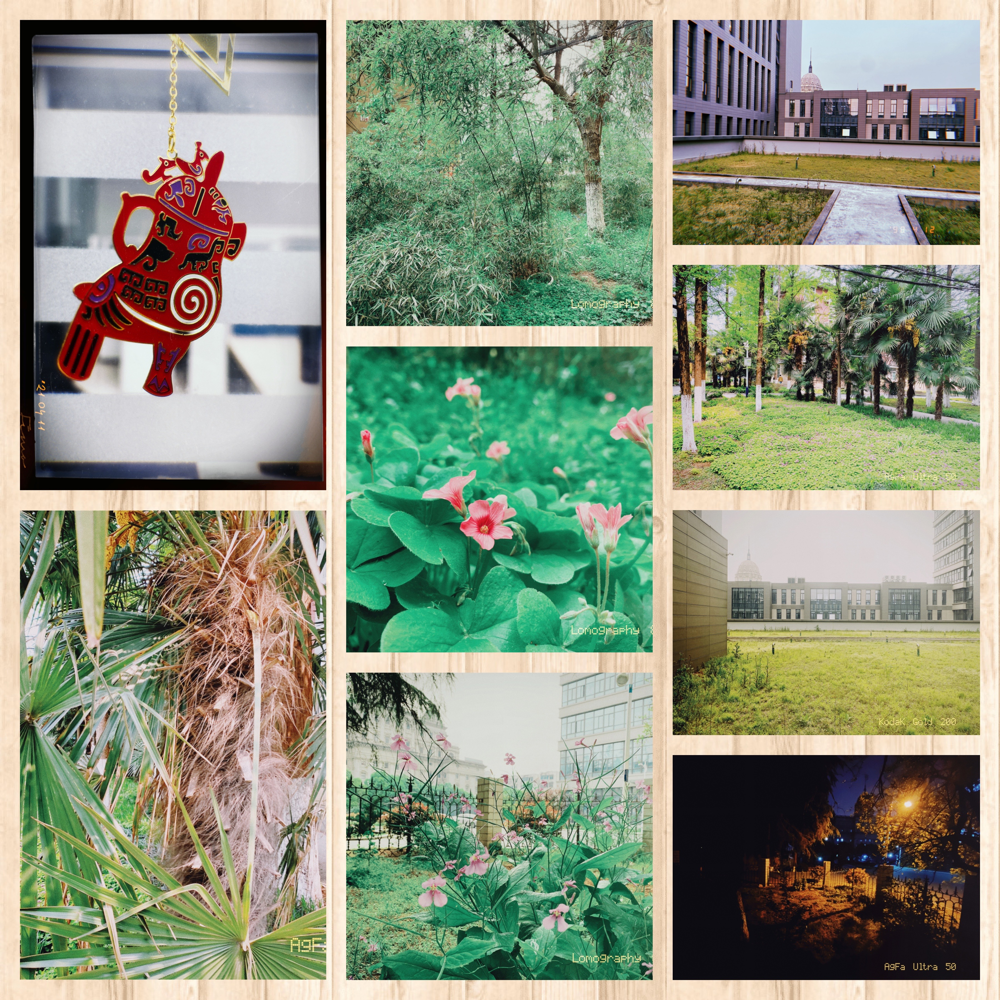
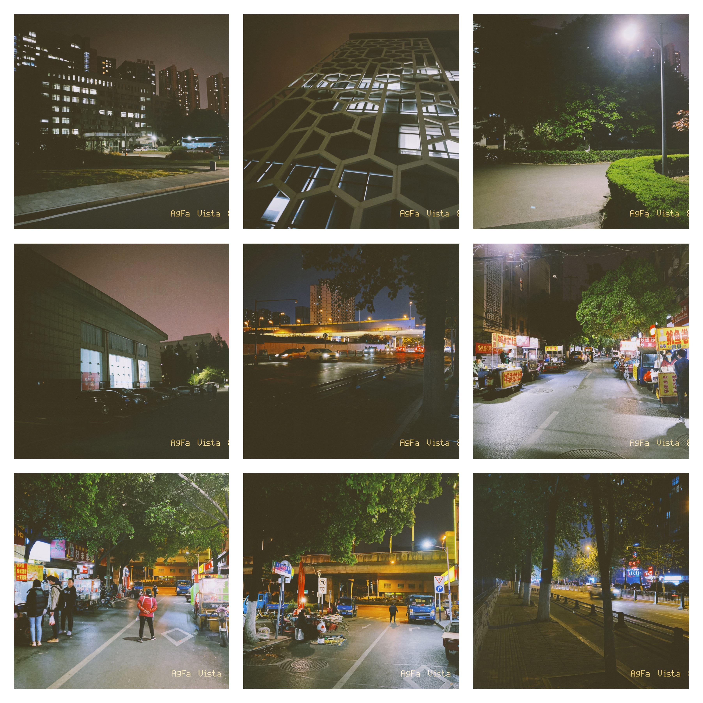
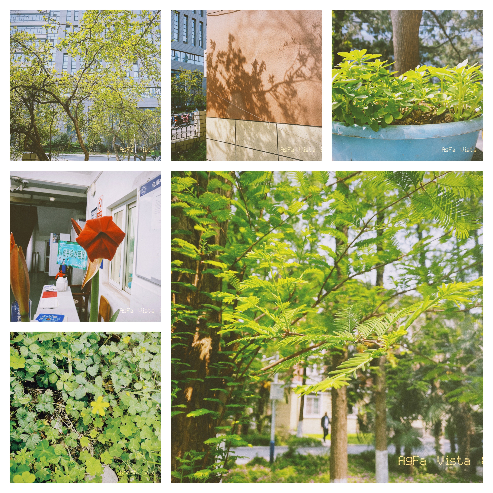
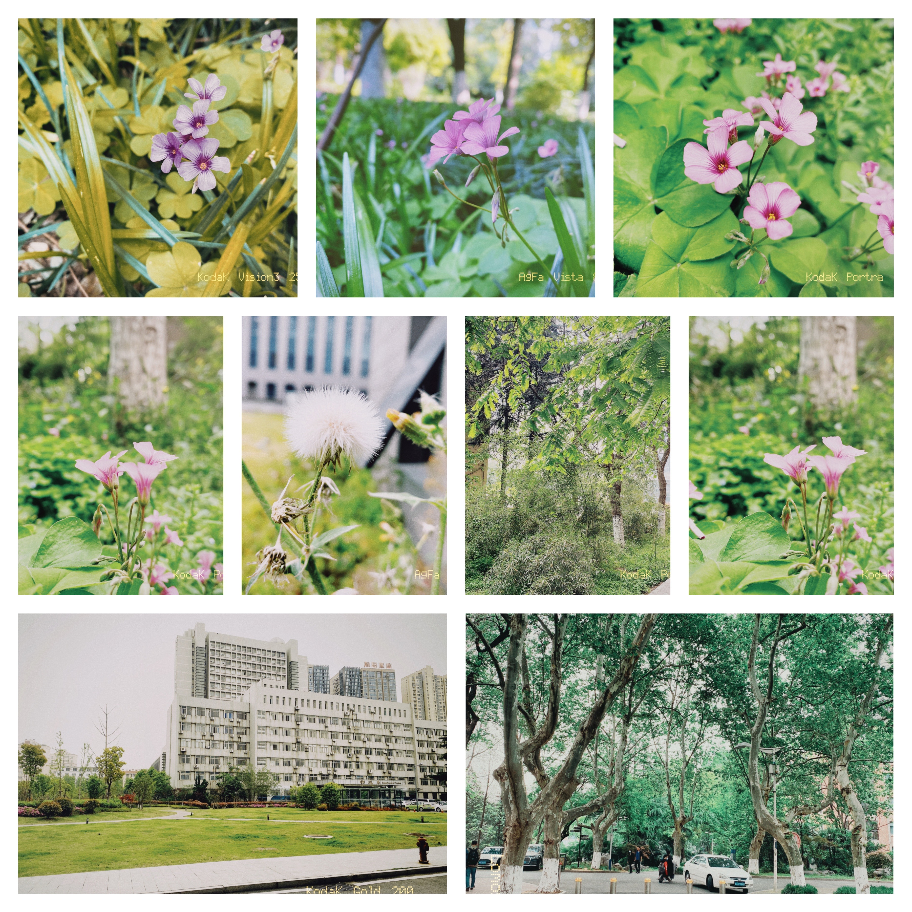
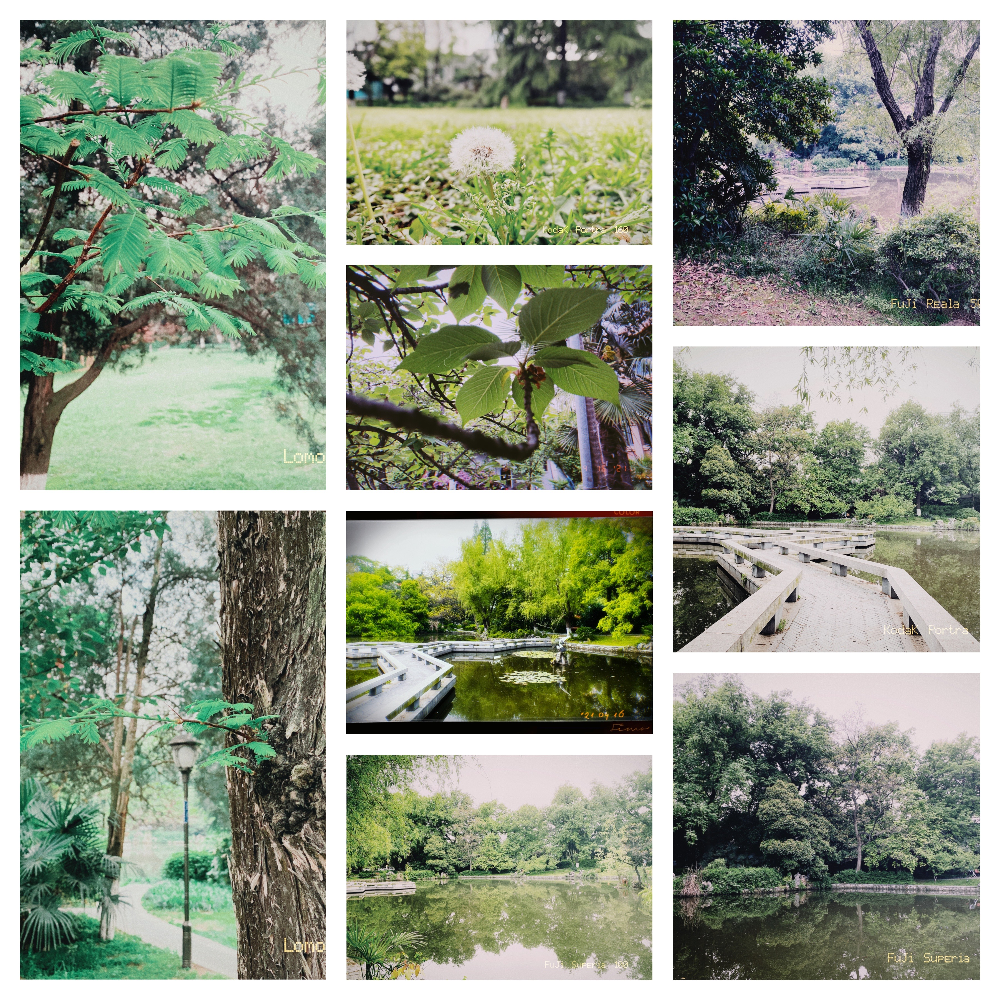
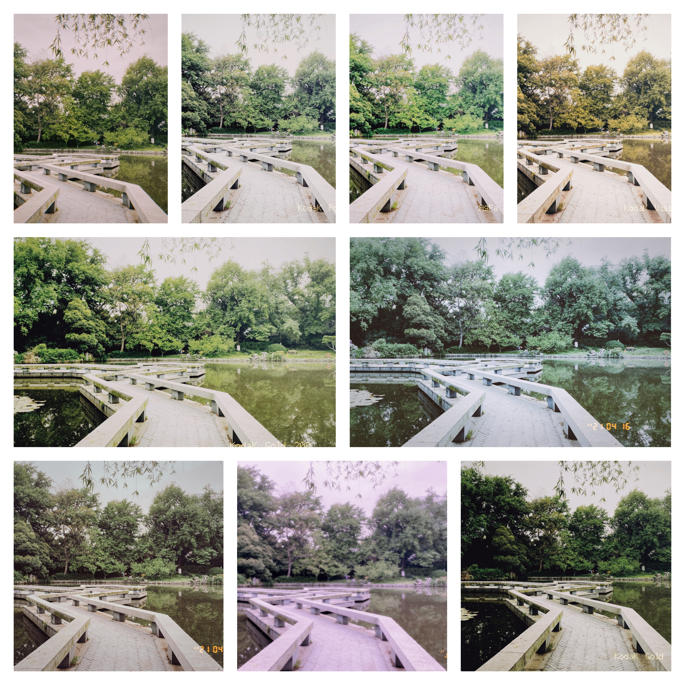
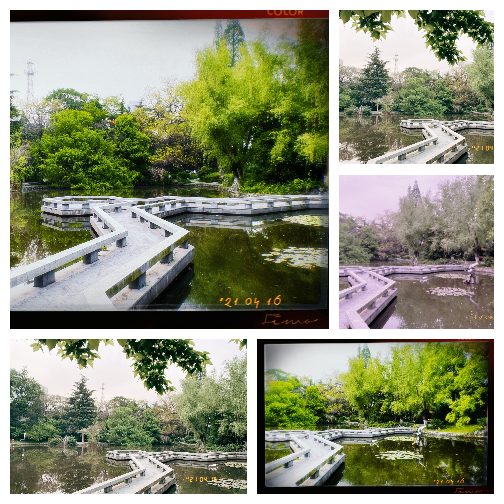

前几天非常偶然的机会，在知乎上看到一个介绍 iOS 上值得安装的软件，放在以前我肯定是想也不想就拿鼠标滚过去了，但是因为我已经把手机上的知乎卸载，有点小无聊，就点开看了下去。里面提到了胶片拍照的 app，抑制不住好奇心，下了一大堆类似的胶片 app。

第一天用下来，感受就是自己以前的修图风格就有点像胶片。虽然两者差别很大，但是对于我来说，主要就是要看起来舒服，胶片也好，修图也好，即使别人觉得很垃圾，我还是以自己的眼光为标准。

胶片 app 使用起来和给照片套上一层滤镜的效果差不多，但是不同 app 的效果还有点不一样，这里分享一些这几天拍的照片。为了避免上传图片的顺序问题，这篇文字中包含的图片都是经过拼图软件处理过的。图片占用空间比较大，加载可能比较慢，放在末尾。

使用的 app，现在还留着的有：最后一卷胶片，FIMO，NOMO，Dazz，Huji，RollFilmTimes，Low Polar。顺序几乎就是使用频率，其中 FIMO 和 NOMO 是网络上评价和评论比较多的，二者选择空间比较大，但是收费有点劝退。我还没到那种无脑购的程度，也是因为这个原因，我才从胶片种类还算多，同时可以通过拍照解锁胶片的 最后一卷胶片 开始玩，等到拍满180张照片的时候，已经可以解锁 9 种胶片，自己拍着玩玩已经完全够了。

吃过晚饭之后，去眼镜湖那边拍了一些照片，视野比较开阔，于是就对着同一个角度，用不同的胶片，甚至用了不同的 app，拍了一些照片，可能胶片的感觉和滤镜真的不一样，比如 最后一卷胶片 和 FIMO 的感觉就比较像是滤镜，而 NOMO 的出片质感就比较像胶片，虽然我上一次接触胶片的记忆还在几乎二十年前。但是作为一个业余选手，拿一堆照片给我叫我分辨那个是胶片哪个是滤镜，是万万不能的。

现在决定先把 最后一卷胶片 这个 app 先放在一边，试几天 FIMO 比如再拍 180 张，NOMO 可以放在更后面尝试。各个软件内购的方式和价格还不完全一样，让我很是犹豫。再试试吧，也许也只是三分钟热度，现在已经在 FIMO 买了两个一元钱的胶片。最后还是要多拍点体验体验，找到适合自己的胶片和拍照方式，多用几个 app 也是可以接受的。

2021-04-16

------

------

